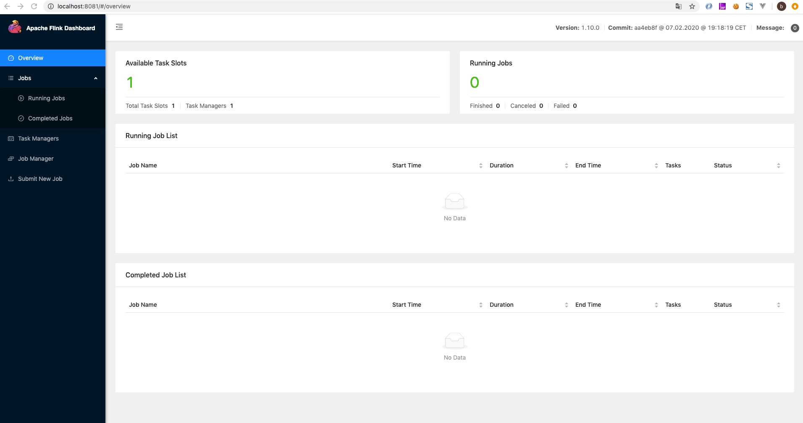
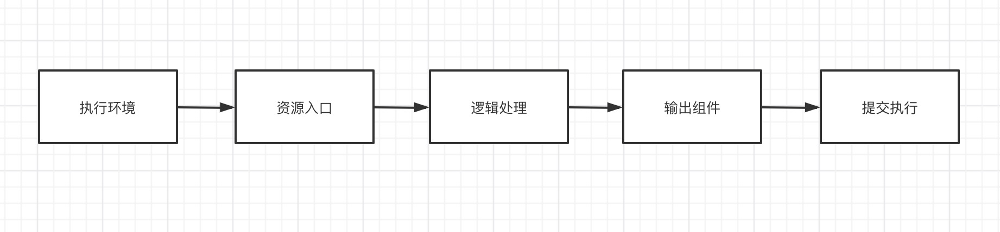
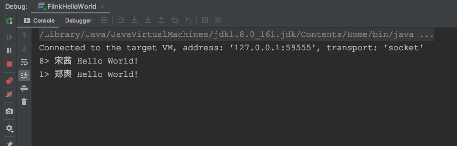
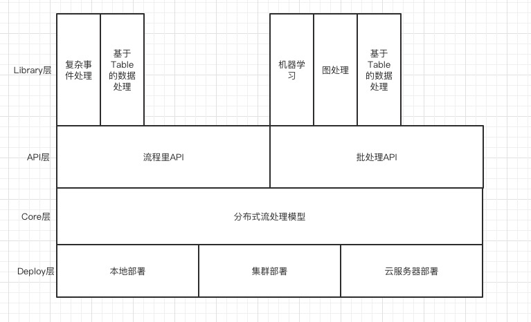

# 这篇帖子介绍
起初这个项目是想封装一些Flink开发中常用的UDF/UDTF/UDAF函数，但是在学习的过程中发现系统介绍Flink的相关资料不是很多。查阅各种文档和书籍后，决定把学习的过程记录下来。

所以这个项目中主要包含了Flink相关的以下内容：

	1. Flink简介
	2. Flink安装
	3. Flink快速入门
	4. Flink常用API以及代码实例
	5. Flink相关知识点介绍
	6. Flink实时数据分析平台 
	   前端：NodeJs+Vue+Webpack+Iview, 后端：SpringBoot+Jpa+MySql+Kafka+Flink

## Flink简介

Apache Flink官方文档地址：https://ci.apache.org/projects/flink/flink-docs-release-1.9/zh/

Apache Flink源码地址：https://github.com/apache/flink

Flink是一个开源的流处理框架，具有分布式、高性能、高可用等特点。
Flink源码主要是由Java语言实现的，同时支持流处理和批处理。Flink的主要应用于流式数据分析场景，例如实时ETL、实时报表、监控预警、在线系统等场景。

## Flink安装
Flink的安装部署分为两种模式：单机模式和集群模式。集群模式又细分为Standalone、Flink on Yarn模式，其中Flink on Yarn模式需要依赖Hadoop集群。在学习了解Flink的时候，我选择的是单机模式。
### 安装环境：

1. 系统环境：macOs - 10.14.5
2. Jdk版本：java version "1.8.0_161"
3. 安装命令：brew install apache-flink
4. Flink版本：Version: 1.10.0

### 查看Flink安装路径：brew info apache-flink
```java
BrucedeMacBook-Pro:flink-easy-function brucexie$ brew info apache-flink
apache-flink: stable 1.10.0, HEAD
Scalable batch and stream data processing
https://flink.apache.org/
/usr/local/Cellar/apache-flink/1.10.0 (159 files, 311.4MB) *
  Built from source on 2020-05-28 at 10:43:02
From: https://mirrors.ustc.edu.cn/homebrew-core.git/Formula/apache-flink.rb
==> Requirements
Required: java = 1.8 ✔
==> Options
--HEAD
	Install HEAD version
==> Analytics
install: 1,058 (30 days), 2,935 (90 days), 17,906 (365 days)
install-on-request: 1,052 (30 days), 2,922 (90 days), 17,821 (365 days)
build-error: 0 (30 days)
```

### 修改配置否则无法正常停止
通过brew info apache-flink命令可以看到我的Flink默认安装路径：/usr/local/Cellar/apache-flink/1.10.0 
	1. 在改目录下创建pid文件夹: /usr/local/Cellar/apache-flink/1.10.0/pid
	2. cd /usr/local/Cellar/apache-flink/1.10.0/libexec/libexec
	3. vim config.sh, 修改默认PID存储路径DEFAULT_ENV_PID_DIR为：/usr/local/Cellar/apache-flink/1.10.0/pid/

```java
104 # WARNING !!! , these values are only used if there is nothing else is specified in
105 # conf/flink-conf.yaml
106 
107 DEFAULT_ENV_PID_DIR="/usr/local/Cellar/apache-flink/1.10.0/pid/"                          # Directory to store *.pid files to
108 DEFAULT_ENV_LOG_MAX=5                               # Maximum number of old log files to keep
109 DEFAULT_ENV_JAVA_OPTS=""                            # Optional JVM args
110 DEFAULT_ENV_JAVA_OPTS_JM=""                         # Optional JVM args (JobManager)
111 DEFAULT_ENV_JAVA_OPTS_TM=""                         # Optional JVM args (TaskManager)
112 DEFAULT_ENV_JAVA_OPTS_HS=""                         # Optional JVM args (HistoryServer)
113 DEFAULT_ENV_SSH_OPTS=""                             # Optional SSH parameters running in cluster mode
114 DEFAULT_YARN_CONF_DIR=""                            # YARN Configuration Directory, if necessary
115 DEFAULT_HADOOP_CONF_DIR=""                          # Hadoop Configuration Directory, if necessary

```

### 启动Flink
进入Flink启动目录：/usr/local/Cellar/apache-flink/1.10.0/libexec/libexec
```java
BrucedeMacBook-Pro:libexec brucexie$ ./start-cluster.sh 
Starting cluster.
Starting standalonesession daemon on host BrucedeMacBook-Pro.local.
Starting taskexecutor daemon on host BrucedeMacBook-Pro.local.
BrucedeMacBook-Pro:libexec brucexie$ 
```

访问Flink服务管理页面：http://localhost:8081/



### 停止Flink
```java
BrucedeMacBook-Pro:libexec brucexie$ ./stop-cluster.sh 
Stopping taskexecutor daemon (pid: 25468) on host BrucedeMacBook-Pro.local.
Stopping standalonesession daemon (pid: 25197) on host BrucedeMacBook-Pro.local.
BrucedeMacBook-Pro:libexec brucexie$ 
```

## Flink快速入门

源码地址：https://github.com/xieyucan/flink-easy-function/blob/master/src/main/java/com/xh/flink/easy/study/FlinkHelloWorld.java

Flink为我们提供了3个组件：DataSource、Transformation、DataSink。

DataSource： 数据源组件，主要用来接收数据资源；
Transformation: 算子，用来处理业务逻辑；
DataSink: 输出组件，用来将处理后的数据输出到指定组件，可以是数据库也可以是文件。

Flink对于数据接收组件、算子和输出组件都提供了常见的API并保留了可自定义扩展的API。结合以上内容，我们的Task研发流程可以分为以下几个步骤：

 1. 获取执行环境Environment对象
 2. 获取资源输入DataSource/DataSet对象
 3. 执行Transaformation业务处理逻辑
 4. 绑定输出DataSink对象
 5. 启动任务



### 添加maven依赖
```java
<properties>
	<java.version>1.8</java.version>
	<flink.version>1.10.0</flink.version>
	<project.build.sourceEncoding>UTF-8</project.build.sourceEncoding>
</properties>

<dependencies>

	<dependency>
		<groupId>org.apache.flink</groupId>
		<artifactId>flink-java</artifactId>
		<version>${flink.version}</version>
	</dependency>

	<dependency>
		<groupId>org.apache.flink</groupId>
		<artifactId>flink-streaming-java_2.11</artifactId>
		<version>${flink.version}</version>
	</dependency>

	<dependency>
		<groupId>org.apache.flink</groupId>
		<artifactId>flink-table-api-java-bridge_2.12</artifactId>
		<version>${flink.version}</version>
	</dependency>

	<dependency>
		<groupId>junit</groupId>
		<artifactId>junit</artifactId>
		<version>4.9</version>
		<scope>test</scope>
	</dependency>
	
	<dependency>
		<groupId>org.slf4j</groupId>
		<artifactId>slf4j-nop</artifactId>
		<version>1.7.2</version>
	</dependency>
		
</dependencies>

<build>
	<plugins>
		<plugin>
			<groupId>org.apache.maven.plugins</groupId>
			<artifactId>maven-compiler-plugin</artifactId>
			<version>3.5</version>
			<configuration>
				<source>${java.version}</source>
				<target>${java.version}</target>
				<encoding>${project.build.sourceEncoding}</encoding>
			</configuration>
		</plugin>
	</plugins>
</build>

```

照常说是不需要flink-table-api-java-bridge_2.12这个依赖的，因为这个项目添加了自定的UDF所以需要依赖这个插件。如果单纯是跑HelloWorld，flink-table-api-java-bridge_2.12和junit这两个组件是都不需要。

### FlinkHelloWorld.java
```java
package com.xh.flink.easy.study;

import org.apache.flink.api.common.functions.FlatMapFunction;
import org.apache.flink.streaming.api.environment.StreamExecutionEnvironment;
import org.apache.flink.util.Collector;

/**
 * Created by xiehui1956(@)gmail.com on 2020/6/2
 */
public class FlinkHelloWorld {

    public static void main(String[] args) throws Exception {

        StreamExecutionEnvironment environment = StreamExecutionEnvironment.getExecutionEnvironment();
        environment.socketTextStream("localhost", 9999)
                .flatMap(new FlatMapFunction<String, String>() {
                    @Override
                    public void flatMap(String value, Collector<String> out) throws Exception {
                        out.collect(value + " Hello World!");
                    }
                }).print();

        environment.execute("Hello World");

    }
}

```

### 执行程序

首先监听端口：9999
```java
BrucedeMacBook-Pro:clickhouse-jdbc brucexie$ nc -lk 9999
 
```

启动程序，然后在监听端口处输入内容观察控制台输出。如下图：

终端：


控制台：




## Flink架构
Flink架构分为4层，Deploy层、Core层、Api层、Library层。

 1. Deploy层：主要涉及Flink的部署集群模式；
 2. Core层：是Flink计算的核心逻辑实现层；
 3. Api层：是对外接口层，提供了流处理Api和批处理Api。不说业务场景，但从使用上来说差不太多；
 4. Library层：应用框架层，在Api层之上构建的满足特定应用的计算框架，面向流处理的CEP(复杂事件处理)、基于SQL-like的操作；面向批处理支持的

FlinkML(机器学习库)、Gelly(图处理)、Table操作。



从架构图可以看出，Flink为我们提供了流处理和批处理两种任务入口。

## Flink常用API
Flink中提供了4种不同层次的Api，如图所示。每种API适用的业务changing不同，这4中API如下：

 1. 底层API：提供了对时间和状态的细粒度操作，主要应用于对一些复杂事件的逻辑处理；
 2. 核心API: 主要提供了流处理和批处理操作入口，可用于针对实时计算和离线数据分析场景；
 3. TableAPI: 可以通过DataStream或DataSet构件内存表，为灵活的处理两种业务逻辑提供可能；
 4. SQL: Flink的SQL是基于Apache Calcite实现了标准的SQL语法，使用起来比API更加灵活易用。结合Table使用SQL，让我们处理逻辑像写SQL一样方便，对拟与常用数据Flink提供了UDF入口，用java或Scala可以灵活的写出各种UDF。

### 流处理API
### 批处理API
### Table/Sql相关API

## Flink状态管理

## Flink窗口

## Flink时间

## Flink并行度
